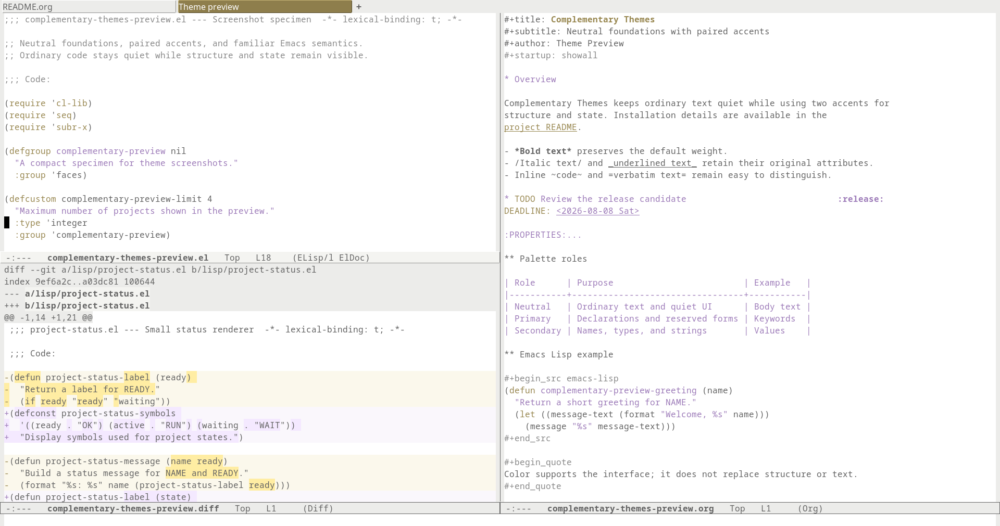
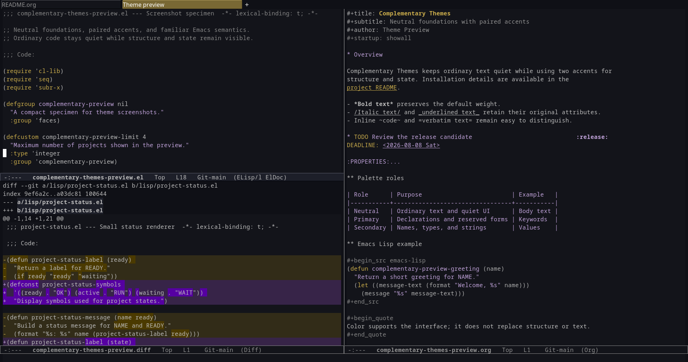
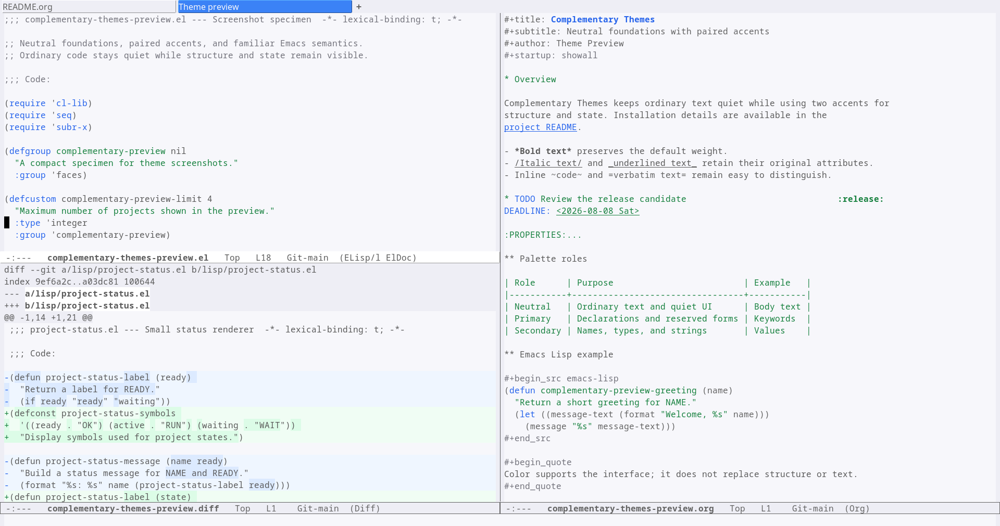
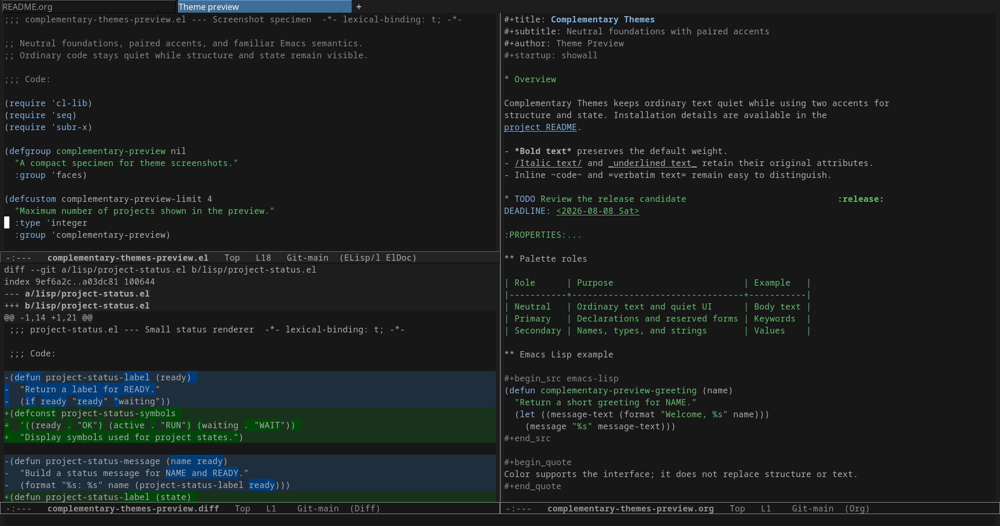
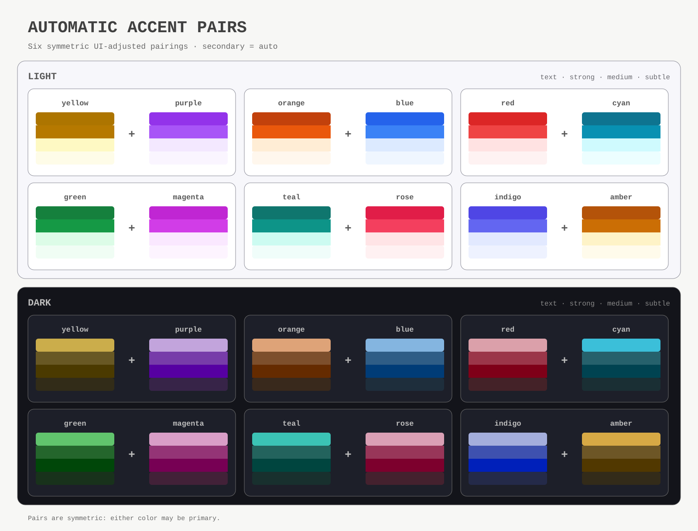
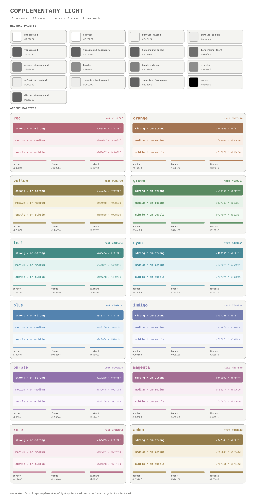
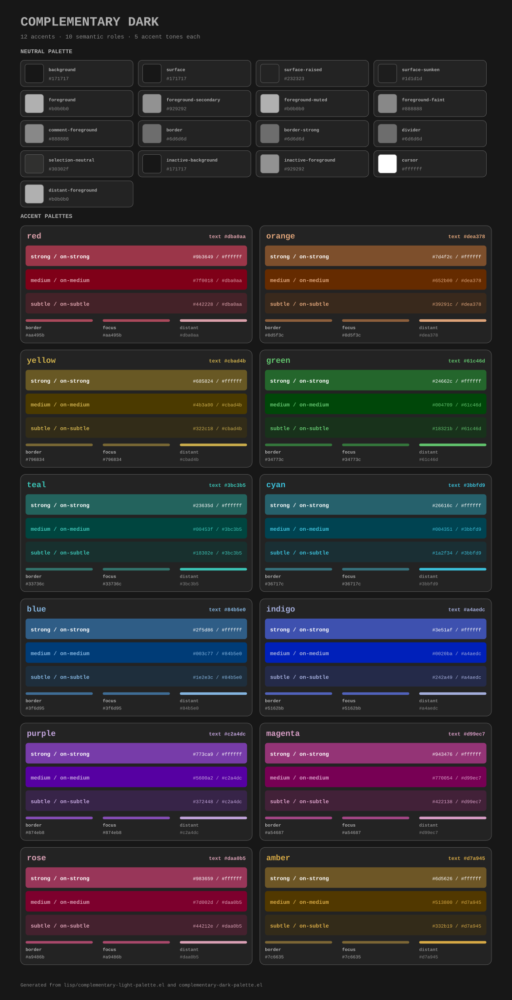

#+title: complementary-themes

This package provides GNU Emacs themes with independently calibrated neutral and accent roles: a vivid perceptual-first light palette and a high-contrast dark palette. ~complementary-light~ uses a low-chroma blue-violet off-white background; ~complementary-dark~ uses a matching blue-black background. Both use cool neutrals plus exactly two registered accent families: primary and secondary. Most ordinary code remains neutral. Declarations and reserved syntax use the primary accent, while names, types, strings, and related constructs use the secondary accent. The themes change colors only, and only where the built-in ~defface~ already uses the corresponding color attribute. Bold, italic, underline, box, strike-through, inverse-video, height, width, inheritance, and extension behavior remain identical to the default ~defface~ specifications.

The secondary color is not intended to be a mathematically exact complementary color. It is a UI-adjusted paired accent chosen for legibility, distinction, and visual harmony on each background.

* Screenshots

These representative screenshots show the same Emacs Lisp, Diff, and Org specimen with automatic and explicitly selected accent pairs.

| Light: yellow + purple (automatic) | Dark: yellow + purple (automatic) |
|  |  |
| Light: blue + green (explicit) | Dark: blue + green (explicit) |
|  |  |

See [[file:Screenshots/README.org][the complete screenshot gallery]] for all 28 light and dark variants.

* Installation and usage

The supported distribution is a normal multi-file ~package.el~ archive. Build it and install the resulting versioned tar file:

#+begin_src sh
make package
#+end_src

Then run ~M-x package-install-file~ and select ~dist/complementary-themes-0.2.0.tar~. The archive contains ~complementary-themes-pkg.el~, uses the directory layout required by ~package.el~, and contains no symbolic links. During installation, ~package.el~ generates its normal package and theme autoload metadata (~theme-loaddefs.el~ on Emacs 30); the generated package autoload adds the installed directory to ~custom-theme-load-path~. No manually installed loader, symbolic link, or source-tree entry in ~custom-theme-load-path~ is required.

After package activation, the theme is visible to ~load-theme~ directly:

#+begin_src emacs-lisp
(load-theme 'complementary-light t)
#+end_src

The package also provides a shared entry point for ~use-package~:

#+begin_src emacs-lisp
(use-package complementary-themes
  :load-path "~/.emacs.d/lisp/complementary-themes/"
  :config
  (setopt complementary-light-primary-color 'yellow
          complementary-light-secondary-color 'auto
          complementary-dark-primary-color 'yellow
          complementary-dark-secondary-color 'auto)
  (load-theme 'complementary-light t))
#+end_src

Use the dark counterpart with the same face policy and paired accents:

#+begin_src emacs-lisp
(load-theme 'complementary-dark t)
#+end_src

The same installation can be performed non-interactively:

#+begin_src emacs-lisp
(package-install-file "/path/to/complementary-themes-0.2.0.tar")

(setq complementary-light-primary-color 'yellow
      complementary-light-secondary-color 'auto)

(load-theme 'complementary-light t)
#+end_src

An explicit secondary color is also supported:

#+begin_src emacs-lisp
(setq complementary-light-primary-color 'yellow
      complementary-light-secondary-color 'blue)
(load-theme 'complementary-light t)
#+end_src

Available color names are ~red~, ~orange~, ~yellow~, ~green~, ~teal~, ~cyan~, ~blue~, ~indigo~, ~purple~, ~magenta~, ~rose~, and ~amber~. Arbitrary HEX, lightness, or saturation input is not supported. Primary and secondary must be distinct; interactive commands reject an identical pair, while a stale identical init value emits a warning and falls back to the registered paired accent. Unknown interactive values likewise signal ~user-error~, and unknown startup values safely fall back to ~yellow~ and its registered pair.

The fixed ~auto~ mappings are symmetric:

| Primary | Secondary | Primary | Secondary |
|---------+-----------+---------+-----------|
| yellow | purple | orange | blue |
| red | cyan | green | magenta |
| teal | rose | indigo | amber |

Five interactive commands are provided:

- ~M-x complementary-light-set-primary-color~
- ~M-x complementary-light-set-secondary-color~
- ~M-x complementary-light-use-color-vision-preset~
- ~M-x complementary-light-refresh~
- ~M-x complementary-light-preview~

The dark theme has independent accent settings and provides:

- ~M-x complementary-dark-set-primary-color~
- ~M-x complementary-dark-set-secondary-color~
- ~M-x complementary-dark-use-color-vision-preset~
- ~M-x complementary-dark-refresh~

The corresponding variables are ~complementary-dark-primary-color~ and ~complementary-dark-secondary-color~. Changing one theme does not change the other.

The color-vision preset selects ~yellow~ plus ~cyan~, the strongest worst-case pair within the generated Machado/CIEDE2000 model, its five semantic roles, and its severity sweep across all 66 distinct accent pairs and both themes. This is a model-relative ranking, not a universal perceptual threshold or accessibility guarantee. Grayscale separation is reported separately; state meaning continues to rely on the original face shape and text, not color alone.

Color commands accept completion candidates only. If the theme is disabled, they change only the current setting. If it is enabled, they safely reapply the theme. Refresh replaces settings belonging to the same Custom Theme and removes obsolete face settings, so it does not accumulate duplicate face specs or duplicate entries in ~custom-enabled-themes~. It does not disable other themes, and it verifies that their relative order and the ~user~ theme remain unchanged. Settings made by these commands affect only the current session and are not written to the Customize file.

Perfect visual composition with multiple themes is not guaranteed. Using ~complementary-light~ on its own is recommended so that precedence remains unambiguous. The theme nevertheless does not automatically disable other themes or modify the ~user~ theme through ~custom-set-faces~.

* Palette and contrast

** Palette reference

The six fixed ~auto~ pairings are shown below in both theme variants. Select the diagram to open the original SVG.

#+caption: The six automatic accent pairs in the light and dark themes

The complete references include the neutral palette and all ten semantic roles for each of the twelve accents. Those roles deliberately share five accent-specific tones—text, strong, medium, subtle, and border—instead of introducing a separate near-duplicate color for every role. The foreground roles on medium and subtle surfaces and ~:distant-foreground~ reuse text; focus reuses border; text on a strong surface uses the polarity-safe neutral. Select either preview to inspect the mappings and HEX values at full size.

#+caption: Complete light palette

#+caption: Complete dark palette

These SVGs are generated directly from the palette definitions with ~make palettes~.

All theme-owned color literals are centralized in [[file:lisp/complementary-light-palette.el][complementary-light-palette.el]] and [[file:lisp/complementary-dark-palette.el][complementary-dark-palette.el]]. Face declarations refer only to semantic tokens such as ~background~, ~foreground-muted~, ~comment-foreground~, ~cursor~, ~primary-text~, and ~secondary-subtle~. Every accent palette provides ~text~, ~strong~, ~on-strong~, ~medium~, ~on-medium~, ~subtle~, ~on-subtle~, ~border~, ~focus~, and ~distant-foreground~ tokens while its constructor maps them onto the smaller five-tone scale. Light-theme tones are hand-tuned for high chroma and useful hue-specific lightness rather than normalized to a common contrast ratio. Medium surfaces use pale high-chroma accent hues, keeping selections and local highlights distinct without muting their color identity. Adaptive ~state~ and ~on-state~ tokens select a vivid strong surface in the light theme and an intermediate accent border surface in the dark theme. The dark state surface is deliberately constrained between its near-black base and white state text, so the single white Emacs cursor also remains visible. The cursor uses a polarity-safe neutral—black in the light theme and white in the dark theme—instead of consuming an accent role.

The theme uses [[https://www.w3.org/TR/WCAG22/][WCAG 2.2]] and [[https://www.w3.org/TR/wcag2ict-22/][WCAG2ICT]] as measurement references. Core neutral colors retain engineering targets of 5.0:1 for text and 3.25:1 for meaningful non-text boundaries. The light accent palette is selected for vividness first: its text colors deliberately span approximately 3.69–5.88:1 against the tinted light base instead of converging on one target. Accent text and non-text roles retain only a 3.0:1 emergency floor that rejects unreadable combinations; measured ratios remain diagnostic rather than a palette optimization objective. Light comments use a dedicated subordinate neutral constrained to 4.5–5.0:1. The dark theme retains its original higher-contrast targets. Because some light accent text is below the WCAG normal-text reference of 4.5:1, the package does not claim blanket WCAG AA conformance.

Relative luminance uses normalized 8-bit sRGB channels. For ~c <= 0.04045~, the linear value is ~c / 12.92~; otherwise it is ~((c + 0.055) / 1.055) ^ 2.4~. Luminance coefficients are 0.2126, 0.7152, and 0.0722. Contrast is ~(Llighter + 0.05) / (Ldarker + 0.05)~.

Tests validate body, secondary, muted, faint, and comment text; accent text; strong/medium/subtle and salient state surfaces; neutral and accent borders; focus indicators; and ~:distant-foreground~ across the complete 144-entry token grid for both themes. Declared overlap scenarios cover region, hl-line, isearch, lazy-highlight, match, diff, completion, and show-paren faces. A separate effective-face gate resolves actual emitted foregrounds, backgrounds, and inheritance for every themed face across all 132 ordered pairs of distinct accents. The cursor is checked against selection, line, completion, match, ordinary accent surfaces, and both salient state surfaces. In the light theme, comments measure ~3.5449:1~; the lowest measured accent ratios are ~3.0001:1~ for text and ~2.5010:1~ for non-text, while the core neutral minima are ~5.0301:1~ and ~3.2519:1~. In the dark theme, comments measure ~5.0574:1~ and all roles retain stronger minima of ~5.0065:1~ for text and ~3.2517:1~ for non-text.

~:distant-foreground~ is used on background-highlight faces such as region, search, completion, match, and hl-line. It remains an Emacs fallback rather than an unconditional foreground override. On 256-color terminals, explicit foreground/background text pairs receive an additional deterministic post-quantization contrast check.

** Built-in color topology

The theme preserves the color topology of each built-in face. A face receives a theme foreground, background, or distant foreground only when its recorded default ~defface~ declares that same attribute. The check is also applied per display clause, so a face that uses only a background in a true-color light frame and only a foreground in a low-color fallback keeps that distinction. The sole UI exception is tab selection: ~tab-bar-tab~ and ~tab-line-tab-current~ receive an explicit paired foreground/background state so that the active tab remains unmistakable and its text remains readable in both theme polarities. ~tab-bar-tab-inactive~ restates its neutral foreground because Emacs inherits it from the active tab face.

For example, the built-in ~org-block~ face inherits ~shadow~ without declaring a background, so the theme does not register an ~org-block~ face spec and does not add a panel behind source blocks. ~org-block-begin-line~ and ~org-block-end-line~ likewise retain their normal inheritance. ~diff-changed~, whose default declaration has no colors of its own, is preserved; ~diff-added~ and ~diff-removed~ retain the default display-dependent foreground/background structure while substituting registered accent tokens only at the corresponding positions.

* Non-color attribute preservation

The theme defines no independent non-color state grammar. Error, warning, success, disabled, added, removed, changed, and focus states retain the exact non-color behavior supplied by their default ~defface~ definitions. In particular, the theme does not add or remove bold, italic, underline, wave, box, strike-through, inverse-video, height, width, inheritance, or extension attributes.

| State | Theme-owned color family | Non-color representation |
|-------+--------------------------+--------------------------|
| Error | Primary | Unchanged from the default face |
| Warning | Secondary | Unchanged from the default face |
| Success | Neutral | Unchanged from the default face |
| Info | Neutral / secondary | Unchanged from the default face |
| Disabled | Neutral | Unchanged from the default face |
| Deleted | Primary | Unchanged from the default diff face |
| Added | Secondary | Unchanged from the default diff face |
| Changed | Primary / secondary | Unchanged from the default diff face |
| Focus | Primary | Unchanged except for theme-owned colors |
| Secondary focus | Secondary | Unchanged except for theme-owned colors |

The face generator extracts ~:family~, ~:foundry~, ~:width~, ~:height~, ~:weight~, ~:slant~, ~:underline~, ~:overline~, ~:strike-through~, ~:box~, ~:inverse-video~, ~:extend~, and ~:inherit~ from the recorded ~defface~ specs for each display condition, then merges those attributes with theme-owned colors. Legacy ~:bold~ and ~:italic~ declarations used by bundled libraries such as Gnus are normalized to their canonical weight and slant attributes. Compound underline and box values preserve their style and line width while only embedded line colors may be replaced by palette tokens. ~complementary-light-non-color-attribute-allowlist~ is deliberately empty.

ERT compares both direct and inheritance-resolved effective attributes before and after applying the theme under the same ~emacs -Q~ display environment. Dedicated diff tests load ~diff-mode~ first and require exact equality for all protected direct and effective attributes. For compound line attributes, the general test normalizes only the embedded color while comparing the remaining structure. Any non-color difference fails the test. GUI and TTY snapshots are not treated as interchangeable expected values.

The active mode line uses the theme foreground on a raised neutral surface so colored status faces remain visible. ~mode-line-buffer-id~ deliberately does not set a foreground; it preserves the original bold weight while inheriting the appropriate active or inactive mode-line foreground.

Ediff, Message, Gnus, ERC, and EWW certificate faces with independent built-in colors are mapped to the same checked semantic tokens. Their original extension, weight, slant, underline, box, and inheritance behavior remains unchanged.

* Meaning of complete face coverage

The coverage target consists of named faces defined by GNU Emacs itself and by standard libraries bundled with the target Emacs installation. Anonymous faces, direct overlay attributes, external packages, user Customize settings, colors inside images/SVG/icons, and direct colors supplied by external programs are outside the inventory scope.

Complete coverage does not mean assigning colors to every face. It means recording every discovered named face in exactly one of these categories:

- ~themed~: declares individual theme color tokens
- ~inherit~: intentionally uses the original inheritance chain
- ~alias~: preserves the face alias relationship
- ~preserve~: intentionally retains original colors and attributes, with a reason
- ~external-semantic~: preserves colors whose meaning belongs to an external protocol
- ~excluded~: excluded for a documented reason
- ~unavailable~: exists in another supported Emacs version but not the current environment

The reviewed Emacs 30.2/GNU/Linux baseline is [[file:inventory/emacs-30.el][emacs-30.el]], while [[file:inventory/current-generated.el][current-generated.el]] contains the most recent generated inventory. The current baseline contains 1,171 faces: 216 ~themed~, 518 ~inherit~, 12 ~alias~, 386 ~preserve~, 39 ~external-semantic~, 0 ~excluded~, and 0 unclassified. The 216 themed faces are maintained as searchable, face-specific declarations rather than being painted by a single blanket rule. The expanded mappings include independently colored Org tables, drawers, columns, agenda and habit states, Isearch groups, Pulse, Smerge, Gnus group/summary/article/server views, ERC current nick, Elisp shorthands, and Newsticker secondary text.

** How the inventory is collected

The generator combines:

1. ~face-list~ immediately after starting ~emacs -Q~
2. The 1,652 ~.el~ and ~.el.gz~ files below ~lisp-directory~
3. Static Emacs Lisp reader extraction of ~defface~, ~custom-declare-face~, ~define-obsolete-face-alias~, and face-alias ~put~ forms
4. ~face-defface-spec~, symbol ~face-alias~ properties, and source-file provenance

The generator does not unconditionally ~require~ every standard library, avoiding network, GUI, process, and user-configuration side effects. It records source file, library, line, default spec, startup-loaded status, alias target, and discovery method. Metadata also includes bundled packages, ~load-path~, source format counts, display capabilities, and daemon capabilities.

#+begin_src sh
make inventory
make test-faces
#+end_src

To update for a new Emacs version:

1. Run ~make inventory~.
2. Compare ~inventory/current-generated.el~ with the reviewed version baseline.
3. Inspect each new face's library and ~defface~ declaration.
4. Explicitly assign ~themed~, ~inherit~, ~alias~, ~preserve~, ~external-semantic~, or ~excluded~.
5. For a themed face, assign semantic tokens individually.
6. Update the version baseline only after review.
7. Run the complete test suite and regenerate reports.

A face absent from the reviewed baseline causes ~test-faces~ to fail with the face name. New faces are not automatically assigned to ~default~ or silently painted neutral.

Org, Transient, use-package, and similar libraries are included in the built-in inventory only when they are bundled with the target Emacs. External-package faces remain outside that inventory count, but ~lisp/complementary-light-packages.el~ supplies color-only rules for a curated set of packages, including those used by the companion ~init.org~. Packages such as BBDB, Consult, Marginalia, Embark, Eglot, Emmet, relint, and which-key already inherit the themed Emacs faces. The separate module replaces independent colors in Avy, Company, Corfu, Denote, diff-hl, Flycheck, Gptel, Helm, Ivy, Magit/Transient, Markdown mode, DDSKK, Tempel, treesit-fold, Vertico, vundo, wgrep, and cognitive-complexity while preserving package-owned non-color attributes.

* ANSI and external colors

Named faces managed by the theme follow the neutral-plus-two-accents principle. ANSI escape sequences, images, SVG content, and colors directly supplied by external programs are outside the two-accent restriction so that their meaning is preserved.

Named faces such as ~ansi-color-*~, ~term-color-*~, and ~xterm-color-*~ are still recorded in the inventory and classified as ~external-semantic~. Quantizing external red, yellow, or green values into two accents could destroy protocol-level failure, warning, or success meanings.

* Preview

~M-x complementary-light-preview~ displays body, secondary, muted, and faint text; bold, italic, underline, wave, box, and strike-through samples; links and semantic states; selections and search matches; line numbers; mode/header/tab lines; tooltip and completion faces; diff/ediff samples; Font Lock faces; short Emacs Lisp, HTML, CSS, JavaScript, JSON, shell, and Org examples; every token from both active accent palettes; declared contrast ratios; and the current display color count.

Inside the preview, ~n~ and ~p~ cycle local paired-accent samples without changing global variables or Customize settings. ~g~ redraws the buffer and ~q~ quits.

Before a release, inspect the preview in actual GUI frames for both themes at the normal and a scaled font size, and exercise Isearch, tab selection, Org agenda/habits, Smerge, completion, and diff views. Record the Emacs build, display backend, font, scale, and terminal emulator with the release notes. The batch reports deliberately do not substitute for rendered visual validation.

** Regenerating screenshots

The screenshot specimen can be regenerated in one graphical Emacs session:

#+begin_src sh
make screenshots
#+end_src

This starts ~emacs -Q~, constructs the same Emacs Lisp, Diff, and Org window layout from the files in ~docs/~, and uses Emacs's built-in ~x-export-frames~ function to write PNG files below ~Screenshots/~. It generates the twelve automatic primary-accent combinations for each theme and the explicit ~yellow~ + ~red~ and ~blue~ + ~green~ examples, for 28 images in total; they are indexed in [[file:Screenshots/README.org][the complete screenshot gallery]]. Existing files with those names are replaced atomically; unrelated files are not removed. Window-manager decorations and other desktop content are intentionally excluded.

A graphical display and an Emacs build with Cairo PNG export support are required. The default frame is maximized and uses ~Monospace-12~. Both can be overridden when a fixed local setup is preferable:

#+begin_src sh
make screenshots SCREENSHOT_GEOMETRY=1600x900 SCREENSHOT_FONT="DejaVu Sans Mono-12"
#+end_src

The requested pixel geometry is subject to window-manager constraints. Every image in one run is exported from the same frame, so its actual dimensions remain consistent. Run ~make test-screenshots~ for the non-graphical manifest and option-validation tests.

* Display environments

Face specs provide four levels:

- GUI true color: ~class color~, ~min-colors 257~; precise sRGB HEX colors are the primary target.
- 256-color terminals: ~class color~, ~min-colors 256~; colors are modeled with Emacs's xterm-256 nearest-color rule. If an explicit text pair would fall below 4.5:1 after quantization, its foreground is moved to the nearest hue-preserving standardized xterm extension color that passes.
- Lower-color terminals: ~class color~, ~min-colors 16~; Emacs and the terminal quantize colors to the available palette while retaining default non-color attributes.
- Monochrome: ~class mono~; original inheritance, bold, italic, underline, box, inverse video, and other default attributes take precedence over color reproduction.

The inventory environment used Emacs 30.2 build 1 on ~gnu/linux~ with a pgtk build. Its batch baseline had ~window-system=nil~ and ~display-color-cells=0~; the host exposed Wayland/X display variables and ~TERM=xterm-256color~. Each theme in the current build registers the same built-in face settings plus package-specific settings; named-daemon loading, refresh, disable, and an xterm-256 pseudo-TTY color probe were tested. Use ~complementary-light~ for light backgrounds and ~complementary-dark~ for dark backgrounds.

Both themes declare Custom Theme metadata for the shared ~complementary~ family, ~color-scheme~ kind, and their light or dark background mode. Emacs features that inspect theme variants can therefore distinguish the pair without relying on the theme name.

In daemon mode, Custom Theme settings become new-frame defaults and therefore apply to frames created later. When GUI and TTY frames coexist, each frame selects its own display clause. The theme does not reload Customize data or call ~custom-set-faces~ when a new frame is created.

* Tests, compilation, and reports

#+begin_src sh
make test
make test-load
make test-palette
make test-contrast
make test-faces
make test-attributes
make test-refresh
make test-terminal
make test-dark
make test-screenshots
make test-package
make compile
make package
make inventory
make reports
make palettes
make screenshots
make clean
#+end_src

Tests use ~emacs -Q --batch~ wherever possible. ~make compile~ byte-compiles the helper modules and checks the theme source for compiler warnings. Source ~.el~ files are authoritative; distribution does not require ~.elc~ files.

~make test-package~ installs the generated tar into an isolated temporary ~package-user-dir~, verifies that no installed file is a symbolic link, checks that package-generated theme metadata exposes the theme to ~custom-available-themes~, and loads, enables, and disables the theme without adding a source-tree path to ~custom-theme-load-path~.

~make reports~ generates:

- ~reports/palette-contrast.json~: every palette, overlap scenario, measured ratio, and requirement
- ~reports/color-vision.json~: diagnostic CIEDE2000 distances under protanomaly, deuteranomaly, tritanomaly, and grayscale simulation, plus all-pair rankings and the ~yellow~/~cyan~ preset; all 20,460 measurements are evaluated and the worst severity for each context is retained in the file, with explicit model-scope and metric-limit metadata
- ~reports/effective-face-contrast.json~: statically selected true-color foreground/background pairs after resolving theme rules, aliases, and literal inheritance; the full inventory retains separate WCAG review observations, while themed-face worst cases gate only the light theme's emergency floors and the dark theme's original stronger targets
- ~reports/cursor-surface-contrast.json~: all valid accent pairs are gated against common overlays and both salient state surfaces; the weakest pair for each surface is retained in the file
- ~reports/face-coverage.json~: face, provenance, classification, target, token, and reason
- ~reports/non-color-attribute-diff.json~: display environment, allowlist, and unexpected differences
- ~reports/display-fallbacks.json~: true-color, terminal, and monochrome policy
- ~reports/theme-summary.json~: version, classification counts, separate neutral/accent targets, minimum ratio, and registered spec count

* Known limitations

- Emacs 30.2 is the minimum supported version and the measured inventory and attribute baseline. Newer Emacs releases require a regenerated inventory and review of every newly discovered face before support is claimed.
- The color-vision report uses Machado, Oliveira, and Fernandes matrices at severities 0.1 through 1.0, a linear-sRGB grayscale transform, and [[https://doi.org/10.1002/col.1049][CIEDE2000]]. CIEDE2000 is primarily validated for small adjacent color differences, and no universal Delta-E value establishes UI accessibility. The report is therefore diagnostic, deliberately has no pass/fail threshold, and describes the preset only as the best pair within the selected model, roles, and severity sweep.
- The effective-face report is a role-aware but conservative static pgtk simulation of the recorded ~defface~ data. Macro-generated specs that cannot be safely expanded are marked unauditable, and real GUI rendering still depends on Emacs, the font backend, and the display stack. The report records both raw 4.5:1 observations and the smaller role-gated review set.
- Emacs exposes a single cursor background. The state surfaces are calibrated so that this neutral passes the non-text target on every declared ordinary, overlay, and salient-state surface; unlisted third-party overlays can still introduce an unknown adjacency.
- Actual terminal quantization depends on the terminal emulator, ~TERM~, terminfo, and configurable ANSI base colors. The standard xterm-256 extension and safe non-color fallbacks are tested, but rendered colors cannot be guaranteed for every terminal.
- Unlisted external-package faces, anonymous faces, images, SVG content, and direct ANSI colors remain outside the duotone restriction.
- Complete visual composition with other themes, arbitrary user face overrides, and font-specific line rendering is outside the guarantee.

* File layout

- ~complementary-light-theme.el~, ~complementary-dark-theme.el~: theme declarations, safe helper loading, and face registration
- ~complementary-themes.el~: shared ~use-package~ and ~require~ entry point
- ~complementary-light.el~, ~complementary-dark.el~: independent Custom variables, interactive color changes, and idempotent refresh
- ~complementary-themes-pkg.el~: ~package.el~ descriptor for the multi-file archive
- ~lisp/complementary-light-palette.el~: light neutrals, accents, paired accents, and sRGB contrast calculations
- ~lisp/complementary-dark-palette.el~: independently calibrated dark neutrals and accents
- ~lisp/complementary-light-faces.el~: complete classification, per-face rules, attribute preservation, and display spec generation
- ~lisp/complementary-light-packages.el~: color-only support for curated external-package faces
- ~lisp/complementary-light-preview.el~: preview buffer
- ~tools/complementary-light-generate-faces.el~: reader-based built-in face inventory
- ~tools/complementary-light-generate-reports.el~: JSON audit reports
- ~tools/complementary-themes-generate-palettes.el~: deterministic SVG palette references
- ~docs/palettes/~: generated light, dark, and automatic-pair SVG references
- ~inventory/~: reviewed version baseline and latest generated inventory
- ~test/~: ERT suites for lifecycle, palette, contrast, coverage, attributes, refresh, and terminal fallback

* License

GPL-3.0-or-later
